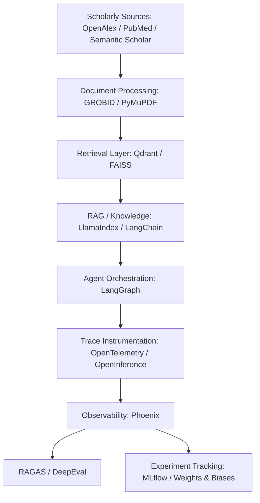
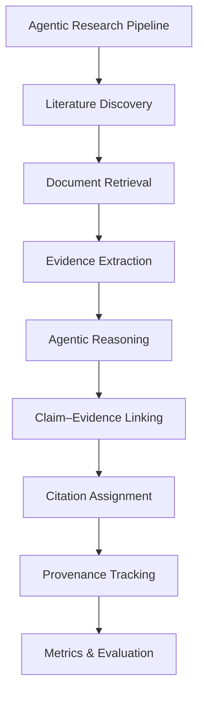

# 🛠️ Tools & Libraries

> **A curated collection of tools, libraries, frameworks, APIs, and standards designed to support the development, tracing, evaluation, and reproducibility of evidence-based, agentic literature synthesis pipelines.**

[](#)
[](#)
[](#)
[](#)
[](#)

This collection emphasizes the technical infrastructure necessary to build **auditable, evidence-grounded, and reproducible agentic literature synthesis systems**.

---

## 📑 Contents

- [🔎 Retrieval & Literature Search](#-retrieval--literature-search)
- [📚 RAG & Knowledge Pipelines](#-rag--knowledge-pipelines)
- [🤖 Agentic Orchestration](#-agentic-orchestration)
- [🔗 Evidence & Citation Evaluation](#-evidence--citation-evaluation)
- [🔬 LLM Evaluation Frameworks](#-llm-evaluation-frameworks)
- [🧭 Tracing & Observability](#-tracing--observability)
- [📊 Experiment Tracking & Evaluation](#-experiment-tracking--evaluation)
- [🗂️ Document Processing](#-document-processing)
- [🧮 Vector Databases & Retrieval Infrastructure](#-vector-databases--retrieval-infrastructure)
- [🧾 Provenance & Traceability Standards](#-provenance--traceability-standards)
- [🎯 Recommended Research Stack](#-recommended-research-stack)
- [📊 Tool-to-Metric Mapping](#-tool-to-metric-mapping)
- [🔬 Research Use Cases](#-research-use-cases)
- [🧠 Proposed Metric Layers](#-proposed-metric-layers)
- [⭐ Recommended Core Toolkit](#-recommended-core-toolkit)
- [🔬 End-to-End Research Architecture](#-end-to-end-research-architecture)
- [📚 Selection Principles](#-selection-principles)
- [🔬 Research Objective](#-research-objective)

---

## 📖 Overview

Evidence-traceable literature synthesis extends beyond mere document retrieval and text generation. It demands maintaining explicit links across various stages, including:

```text
Research Question
       ↓
Search Query
       ↓
Retrieved Paper
       ↓
Evidence Passage
       ↓
Generated Claim
       ↓
Citation
       ↓
Verification
       ↓
Provenance
```

The tools outlined here support each component—from scholarly discovery and document processing to agent orchestration, traceability, evaluation, and provenance management.

---

## 🔎 Retrieval & Literature Search

Tools in this category facilitate discovery and retrieval of scholarly publications:

| Tool | Type | Primary Use | Traceability |  
|:---|:---|:---|:---|  
| **Semantic Scholar** | Scholarly API | Academic literature discovery | ⭐⭐⭐⭐⭐ |  
| **OpenAlex** | Scholarly API | Open scholarly metadata | ⭐⭐⭐⭐⭐ |  
| **Crossref** | Metadata API | DOI & bibliographic metadata | ⭐⭐⭐⭐⭐ |  
| **PubMed / NCBI** | Scholarly API | Biomedical literature | ⭐⭐⭐⭐⭐ |  
| **Europe PMC** | Scholarly API | Biomedical literature & full text | ⭐⭐⭐⭐ |  
| **arXiv API** | Scholarly API | Scientific preprints | ⭐⭐⭐⭐ |  

### Semantic Scholar

Semantic Scholar offers comprehensive scholarly search capabilities and metadata services beneficial for literature discovery and citation network analysis.

**Key Applications**
- Literature discovery
- Citation graph construction
- Related-paper retrieval
- Author metadata analysis
- Research-source identification

**Resources**
- [🌐 Semantic Scholar](https://semanticscholar.org)
- [🔌 Semantic Scholar API](https://api.semanticscholar.org)

### OpenAlex

OpenAlex provides an open catalog of scholarly works, authors, institutions, concepts, and citations.

**Key Applications**
- Building scholarly corpora
- Citation-network analysis
- Bibliographic enrichment
- Trend analysis
- Metadata verification

**Resources**
- [🌐 OpenAlex](https://openalex.org)
- [🔌 OpenAlex API](https://api.openalex.org)

### Crossref

Crossref specializes in persistent identifiers and bibliographic metadata verification.

**Key Applications**
- DOI validation
- Reference normalization
- Publication identification
- Citation integrity auditing
- Metadata enrichment

**Resources**
- [🌐 Crossref](https://crossref.org)
- [🔌 Crossref REST API](https://api.crossref.org)

### PubMed / NCBI

PubMed provides access to biomedical and life sciences literature, ideal for evidence discovery in health sciences.

**Key Applications**
- Biomedical literature retrieval
- Evidence identification
- PMID verification
- Citation metadata extraction

**Resources**
- [🌐 PubMed](https://pubmed.ncbi.nlm.nih.gov)
- [🔌 NCBI E-utilities](https://www.ncbi.nlm.nih.gov/books/NBK25501/)

---

## 📚 RAG & Knowledge Pipelines

Frameworks supporting Retrieval-Augmented Generation (RAG) and external knowledge integration:

| Tool | Primary Function | Agentic RAG | Evaluation | Traceability |  
|:---|:---|:---|:---|:---|  
| **LangChain** | LLM application framework | ✅ | ◐ | ⭐⭐⭐⭐ |  
| **LlamaIndex** | Data & RAG framework | ✅ | ◐ | ⭐⭐⭐⭐⭐ |  
| **Haystack** | Search & RAG framework | ✅ | ◐ | ⭐⭐⭐⭐ |  
| **RAGAS** | RAG evaluation | — | ✅ | ⭐⭐⭐⭐⭐ |  
| **DeepEval** | LLM/RAG evaluation | ✅ | ✅ | ⭐⭐⭐⭐⭐ |  

### LangChain

Provides modular components for building retrieval, tool invocation, agent orchestration, and multi-step research workflows.

**Applications**
- Agentic literature search
- Retrieval pipelines
- Tool invocation
- Multi-step workflows
- Citation-aware generation
- Agent activity logging

**Resources**
- [Documentation](https://docs.langchain.com)
- [GitHub Repository](https://github.com/hwchase17/langchain)

### LlamaIndex

Designed for connecting LLM applications with external data sources, supporting document indexing, retrieval, and synthesis.

**Applications**
- Scientific document indexing
- RAG pipelines
- External data integration
- Citation-aware synthesis
- Knowledge base construction

**Resources**
- [Documentation](https://gpt-index.readthedocs.io)
- [GitHub Repository](https://github.com/jerryjliu/llama_index)

### Haystack

An open-source framework for search, RAG, question answering, and complex agent workflows.

**Applications**
- Literature retrieval
- Semantic search
- RAG & QA pipelines
- Document processing
- Agent orchestration
- Evaluation workflows

**Resources**
- [Documentation](https://haystack.deepset.ai/)
- [GitHub Repository](https://github.com/deepset-ai/haystack)

---

## 🤖 Agentic Orchestration

Explicit representation of actions, tool calls, retrieval, evidence extraction, and verification is crucial:

| Framework | Primary Strength | Traceability Potential |  
|:---|:---|:---|  
| **LangGraph** | Stateful workflows | ⭐⭐⭐⭐⭐ |  
| **AutoGen** | Multi-agent systems | ⭐⭐⭐⭐ |  
| **CrewAI** | Role-based agents | ⭐⭐⭐⭐ |  
| **DSPy** | Programmatic pipelines | ⭐⭐⭐⭐ |  

### LangGraph

Supports complex, stateful, multi-step research workflows integrating retrieval, reading, synthesis, and verification.

**Process Flow**
- Search
- Retrieve
- Read
- Extract Evidence
- Assess Evidence
- Synthesize
- Verify

**Resources**
- [Documentation](https://langgraph.readthedocs.io)
- [GitHub Repository](https://github.com/langgraph/langgraph)

### AutoGen

Facilitates multi-agent interactions, collaborative reasoning, and iterative synthesis.

**Applications**
- Multi-agent research workflows
- Planning and collaboration
- Tool orchestration

**Resources**
- [Documentation](https://github.com/Torantulino/AutoGen)
- [GitHub Repository](https://github.com/Torantulino/AutoGen)

### CrewAI

Supports role-based multi-agent setups for research automation and task delegation.

**Applications**
- Agent teams
- Multi-stage synthesis
- Workflow automation

**Resources**
- [Documentation](https://crewai.readthedocs.io/)
- [GitHub Repository](https://github.com/crewai/crewai)

---

## 🔗 Evidence & Citation Evaluation

Systems for verifying whether generated claims are supported by retrieved evidence:

| Tool / Method | Main Function | Relevance |  
|:---|:---|:---|  
| **RAGAS** | RAG evaluation | ⭐⭐⭐⭐⭐ |  
| **DeepEval** | Faithfulness & RAG evaluation | ⭐⭐⭐⭐⭐ |  
| **ARES** | RAG evaluation | ⭐⭐⭐⭐⭐ |  
| **FActScore** | Atomic factuality | ⭐⭐⭐⭐⭐ |  
| **ALCE** | Citation correctness | ⭐⭐⭐⭐⭐ |  
| **TRUE** | Factual consistency | ⭐⭐⭐⭐ |  

*Note:* Many of these are research methodologies or benchmarks rather than software libraries but are included due to their foundational importance.

### DeepEval

A comprehensive evaluation framework supporting retrieval, faithfulness, hallucination detection, agent evaluation, and custom metrics.

| Framework | RAG | Agents | Custom Metrics | Trace Evaluation |  
|:---|:---|:---|:---|:---|  
| **DeepEval** | ✅ | ✅ | ✅ | ✅ |  
| **RAGAS** | ✅ | ◐ | ✅ | ◐ |  
| **Phoenix** | ✅ | ✅ | ✅ | ✅ |  
| **MLflow** | ✅ | ✅ | ✅ | ✅ |  
| **W&B Weave** | ✅ | ✅ | ✅ | ✅ |  

*Legend:*  
✅ = Full support | ◐ = Partial support | ❌ = Not supported

---

## 🧭 Tracing & Observability

Capturing execution traces enhances evidence traceability:

```
Research Task
     │
     ├── Query Generation
     ├── Search Call
     │      ├── Source A
     │      ├── Source B
     │      └── Source C
     ├── Retrieval
     ├── Evidence Extraction
     ├── Claim Generation
     ├── Citation Assignment
     ├── Verification
     └── Final Synthesis
```

### Phoenix

An open-source platform for AI observability, supporting:

- Agent trace collection
- Retrieval tracing
- Tool call tracing
- Evaluation & debugging

**Resources**
- [Documentation](https://phoenix.ai/docs)
- [GitHub Repository](https://github.com/phoenix-ai/phoenix)

### MLflow

Offers comprehensive experiment tracking, trace storage, and reproducibility.

**Applications**
- Run management
- Metric logging
- Model versioning
- Reproducibility

**Resources**
- [Documentation](https://mlflow.org)
- [GitHub Repository](https://github.com/mlflow/mlflow)

### OpenTelemetry & OpenInference

OpenTelemetry provides a unified framework for distributed tracing, while OpenInference offers conventions for AI/LLM instrumentation.

**Representation Example:**

```plaintext
Agent
 ├── LLM Call
 ├── Retriever
 ├── Tool
 ├── Document
 ├── Evidence
 ├── Citation
 └── Evaluation
```

**Resources**
- [🌐 OpenTelemetry](https://opentelemetry.io/)
- [💻 OpenInference](https://github.com/OpenInference)

---

## 📊 Experiment Tracking & Evaluation

Supporting systematic experimentation:

| Tool | Primary Purpose |  
|:---|:---|  
| **MLflow** | Experiment and trace tracking |  
| **Weights & Biases** | Experiment management |  
| **W&B Weave** | LLM tracing & evaluation |  
| **Phoenix** | AI observability & evaluation |  
| **TensorBoard** | Visualization |  

## 🧾 Document Processing

Handling scientific documents across formats:

| Tool | Function | Use Case |  
|:---|:---|:---|  
| **GROBID** | PDF → structured XML/TEI | Extracting metadata, references |  
| **PyMuPDF** | PDF extraction | Text, images, layout |  
| **Unstructured** | Document parsing | Chunking, metadata |  
| **Apache Tika** | Content extraction | HTML, XML |  
| **BeautifulSoup** | HTML parsing | Web content |  

### GROBID

Specialized in extracting structured information from PDFs, such as titles, authors, abstracts, references, and citations.

**Resources**
- [💻 GROBID GitHub](https://github.com/kermitt2/grobid)

### PyMuPDF

Supports extraction of text, images, and structural info from PDFs.

**Resources**
- [📑 PyMuPDF Documentation](https://pymupdf.readthedocs.io/)

### Unstructured

Provides flexible document processing, chunking, and metadata extraction for LLM workflows.

**Resources**
- [📚 Documentation](https://unstructured.io/)
- [💻 GitHub Repository](https://github.com/Unstructured-IO/unstructured)

---

## 🧮 Vector Databases & Retrieval Infrastructure

Persistent, similarity-aware storage systems:

| Tool | Type | Main Use |  
|:---|:---|:---|  
| **FAISS** | Vector Library | Similarity search |  
| **Qdrant** | Vector Database | Metadata-aware retrieval |  
| **Milvus** | Vector Database | Large-scale retrieval |  
| **Weaviate** | Vector Database | Semantic search |  
| **Chroma** | Vector Database | Local RAG development |  

### Evidence Metadata Standards

When storing evidence, preserve metadata such as:

```json
{
  "document_id": "doi:10.xxxx/xxxxx",
  "title": "Research Paper",
  "authors": ["Author A", "Author B"],
  "year": 2026,
  "page": 7,
  "section": "Results",
  "chunk_id": "paper_001_chunk_042",
  "retrieval_score": 0.91,
  "doi": "10.xxxx/xxxxx"
}
```

This enables tracing claims back to their precise evidence source.

---

## 🧾 Provenance & Traceability Standards

Standards supporting provenance and traceability:

| Standard / Technology | Purpose | Relevance |  
|:---|:---|:---|  
| **W3C PROV** | Provenance modeling | ⭐⭐⭐⭐⭐ |  
| **OpenTelemetry** | Distributed tracing | ⭐⭐⭐⭐⭐ |  
| **OpenInference** | LLM instrumentation | ⭐⭐⭐⭐⭐ |  
| **RO-Crate** | Research object packaging | ⭐⭐⭐⭐ |  
| **DataCite** | Persistent identifiers | ⭐⭐⭐⭐ |  
| **Crossref** | Scholarly metadata | ⭐⭐⭐⭐⭐ |  

### W3C PROV

Provides a formal framework to model provenance, representing entities, activities, and agents:

```plaintext
Entity
  │ wasDerivedFrom
  ▼
Entity
  │ wasGeneratedBy
  ▼
Activity
  │ wasAssociatedWith
  ▼
Agent
```

**In literature synthesis:**

- Research Paper → Evidence Passage → Claim → Citation → Report

**Resources**
- [🌐 W3C PROV Overview](https://www.w3.org/TR/prov-overview/)

---

## 🎯 Recommended Research Stack

An effective prototype integrates the following tools:

| Layer | Recommended Tools |  
|:---|:---|  
| **Literature Discovery** | OpenAlex, Semantic Scholar |  
| **Metadata Verification** | Crossref |  
| **Biomedical Literature** | PubMed, Europe PMC |  
| **Document Processing** | GROBID, PyMuPDF |  
| **Vector Retrieval** | Qdrant, FAISS |  
| **RAG Framework** | LlamaIndex, LangChain |  
| **Agent Orchestration** | LangGraph |  
| **Traceability** | OpenTelemetry, OpenInference |  
| **Observability** | Phoenix |  
| **Evaluation** | RAGAS, DeepEval |  
| **Experiment Tracking** | MLflow |  
| **Provenance** | W3C PROV |  

---

## 📊 Tool-to-Metric Mapping

| Metric Dimension | Recommended Tools |  
|:---|:---|  
| **Retrieval Recall** | OpenAlex, Semantic Scholar, RAGAS |  
| **Retrieval Precision** | RAGAS, DeepEval |  
| **Source Coverage** | OpenAlex, Crossref |  
| **Claim–Evidence Alignment** | DeepEval, custom evaluators |  
| **Evidence Localization** | GROBID, PyMuPDF |  
| **Citation Correctness** | Crossref, custom citation evaluators |  
| **Faithfulness** | RAGAS, DeepEval |  
| **Hallucination Rate** | DeepEval, RAGTruth |  
| **Agent Trajectory Quality** | DeepEval, Phoenix |  
| **Provenance Completeness** | W3C PROV, OpenTelemetry |  
| **Trace Completeness** | Phoenix, OpenTelemetry |  
| **Workflow Efficiency** | Phoenix, MLflow |  
| **Reproducibility** | MLflow, W&B |  
| **Regression Testing** | DeepEval, MLflow |  

---

## 🔬 Research Use Cases

### 1. Evidence Retrieval Evaluation

```plaintext
Research Question
       ↓
Literature Search
       ↓
Candidate Papers
       ↓
Retrieved Evidence
       ↓
Metrics: Precision / Recall / Relevance
```

**Suggested Tools:** OpenAlex, Semantic Scholar, RAGAS, DeepEval

---

### 2. Claim–Evidence Traceability

```plaintext
Generated Claim
       ↓
Supporting Citation
       ↓
Evidence Passage
       ↓
Original Paper
       ↓
Persistent Identifier
```

**Suggested Tools:** GROBID, Crossref, W3C PROV, custom evaluators

---

### 3. Agent Workflow Traceability

```plaintext
Agent
 ├── Search
 ├── Retrieve
 ├── Read
 ├── Extract
 ├── Synthesize
 ├── Cite
 └── Verify
```

**Suggested Tools:** LangGraph, OpenTelemetry, Phoenix

---

### 4. Citation Integrity

Evaluate citations across dimensions:

- Correct source?
- Correct paper?
- Supports claim?
- Evidence present?
- Citation location correct?

**Suggested Tools:** Crossref, GROBID, DeepEval, custom metrics

---

## 🧠 Proposed Metric Layers

Hierarchical framework for evidence-traceability:

```
Evidence Traceability
│
├── Retrieval Layer
│   └── Recall / Precision
│
├── Evidence Layer
│   └── Coverage / Relevance
│
├── Generation Layer
│   └── Faithfulness / Hallucination
│
├── Citation Layer
│   └── Alignment / Correctness
│
├── Provenance Layer
│   └── Completeness / Traceability
│
└── Agent & Workflow Trace
    └── Reproducibility / Auditability
```

---

## ⭐ Recommended Core Toolkit

For building a research prototype, consider the following:

<details>
<summary><strong>📚 Discovery & Corpus</strong></summary>

- OpenAlex — Scholarly metadata and corpus
- Semantic Scholar — Literature discovery and citation networks
- Crossref — DOI and metadata verification
- PubMed — Biomedical literature

</details>

<details>
<summary><strong>📄 Processing & Retrieval</strong></summary>

- GROBID — Scientific PDF parsing
- PyMuPDF — PDF extraction
- Qdrant / FAISS — Vector similarity search
- LlamaIndex / LangChain — RAG pipelines

</details>

<details>
<summary><strong>🤖 Agent Layer</strong></summary>

- LangGraph — Stateful agent orchestration
- AutoGen — Multi-agent workflows
- CrewAI — Role-based agent management

</details>

<details>
<summary><strong>🧭 Traceability Layer</strong></summary>

- OpenTelemetry — Distributed tracing
- OpenInference — AI/LLM instrumentation
- Phoenix — Observability & evaluation

</details>

<details>
<summary><strong>📏 Evaluation Layer</strong></summary>

- RAGAS — Retrieval and answer evaluation
- DeepEval — LLM, RAG, agent evaluation

</details>

<details>
<summary><strong>📊 Experiment Layer</strong></summary>

- MLflow — Run management and reproducibility
- Weights & Biases — Experiment tracking

</details>

<details>
<summary><strong>🧾 Provenance Layer</strong></summary>

- W3C PROV — Provenance modeling
- OpenTelemetry — Execution tracing

</details>

---

## 🔬 End-to-End Research Architecture



---

## 🧾 Example Evidence-Traceability Record

```json
{
  "claim_id": "claim_017",
  "claim_text": "The retrieval method improves evidence coverage.",
  "source_document": {
    "title": "Example Research Paper",
    "doi": "10.xxxx/example"
  },
  "evidence": {
    "page": 6,
    "section": "Results",
    "chunk_id": "chunk_042"
  },
  "retrieval": {
    "method": "hybrid",
    "rank": 2,
    "score": 0.91
  },
  "citation": {
    "citation_id": "cite_017",
    "verified": true
  },
  "evaluation": {
    "evidence_relevance": 0.94,
    "claim_support": 0.89,
    "citation_correctness": 1.0
  }
}
```

This structure allows multi-level metrics, including claim, evidence, citation, document, agent step, and entire workflow.

---

## 📚 Selection Principles

Tools should ideally support:

- Scholarly literature retrieval
- Passage-level evidence preservation
- Metadata and provenance tracking
- Agent execution and traceability
- Retrieval and faithfulness evaluation
- Reproducible experiments
- Open standards integration

---

## 🔬 Research Objective

The overarching goal is to develop systems that make the entire evidence chain **observable, measurable, and auditable**, enabling researchers to trace any claim back to its supporting evidence and source, while reconstructing the agent’s research process.

> *A trustworthy agentic literature synthesis system must be evaluated not only on final output correctness but also on its ability to retrieve relevant evidence, connect claims to sources, preserve provenance, and facilitate auditability.*

---

## 🌟 Final Perspective

Developing a reliable, transparent, and reproducible research pipeline involves tools that support:

- Evidence retrieval and verification
- Provenance and traceability
- Reproducibility of experiments
- Clear documentation of the research process

Together, these components establish a multidimensional framework for trustworthy scientific knowledge synthesis.

---

## 🔬 Evidence-Traceability Pipeline



---

## 🧾 Suggested Repository Structure

```
.
├── README.md
├── paper/
│   └── AI_Assisted_Research_Paper.pdf
├── references/
│   └── references.md
├── datasets/
│   └── datasets.md
├── tools/
│   └── tools.md
├── implementations/
│   └── implementations.md
├── tutorials/
│   └── tutorials.md
└── citation-audit/
    └── Citation_Integrity_Audit.pdf
```

---

<p align="center">
🔎 Retrieve → 📚 Evidence → 🔗 Connect → 🧾 Cite → 🧭 Trace → ✅ Verify

Building trustworthy, transparent, reproducible, and auditable agentic literature synthesis systems.

⭐ If this resource supports your research, please consider starring this repository!
</p>
